<p align="center">
<p align="center">
<a  href="https://www.salesforce.com/connections/"></a>
<a  href="https://www.salesforce.com/"></a>
<p/>
<p align="center">
<a  href="https://www.salesforce.com/data/"></a>
<a  href="https://www.salesforce.com/ca/agentforce/"></a>
<a  href="https://developer.salesforce.com/docs/marketing/einstein-personalization/guide/overview.html"></a>
<p/>
<p/>

# Connections 2025 Demo: Boost Telecom Revenue with Personalized Upselling

This solution was presented at Salesforce Connections 2025, June 12th. It showcases how you can personalized your website based on a chat conversation you have with a Agentforce chatbot. The demo can be tested by going to the following [link](https://salesforce-connections-demo-665a3c7c9aa0.herokuapp.com/).

NOTE: You can ask about mobile devices, mobile plans, internet plans, bundles, entertainment or streaming options to trigger a personalization. Please keep in mind that the Agent will be able to understand only simple inquiries as this is just a simple demo.

> DISCLAIMER: This software is to be considered "sample code", a Type B Deliverable, and is delivered "as-is" to the user. Salesforce bears no responsibility to support the use or implementation of this software.

# Table of Contents

- [Connections 2025 Demo: Boost Telecom Revenue with Personalized Upselling](#connections-2025-demo-boost-telecom-revenue-with-personalized-upselling)
- [Table of Contents](#table-of-contents)
  - [What does it do?](#what-does-it-do)
  - [How does it work?](#how-does-it-work)
    - [Architecture diagram](#architecture-diagram)
  - [Demo: Agentforce chat personalization](#demo-agentforce-chat-personalization)
  - [Technologies used](#technologies-used)
- [Configuration](#configuration)
  - [Requirements](#requirements)
  - [Setup](#setup)
    - [Local environment configuration](#local-environment-configuration)
    - [Development](#development)
    - [Salesforce environment](#salesforce-environment)
      - [Data Cloud](#data-cloud)
      - [Salesforce Flows](#salesforce-flows)
      - [Personalization](#personalization)
      - [Prompt](#prompt)
      - [Apex Class](#apex-class)
      - [Custom Metadata Types](#custom-metadata-types)
      - [Agentforce](#agentforce)
  - [Deployment](#deployment)
      - [Can I deploy this anywhere else other than Heroku?](#can-i-deploy-this-anywhere-else-other-than-heroku)
- [Kudos](#kudos)
- [License](#license)
- [Disclaimer](#disclaimer)

---

## What does it do?

This project demonstrates how to leverage Salesforce Personalization to tailor a user’s experience based on real-time chat interactions. By integrating an Agentforce chatbot with Salesforce Data Cloud event streaming, the application listens for user messages in chat sessions.

The chat messages are then picked up by the Salesforce backend and makes it ready for Salesforce Personalization.

When an incoming message is detected, it triggers a network call to the Salesforce Personalization which delivers individualized recommendations. This ensures that web content, product suggestions, and visual styling are dynamically adapted to each user’s conversation context, providing a customized and engaging experience.

## How does it work?

### Architecture diagram

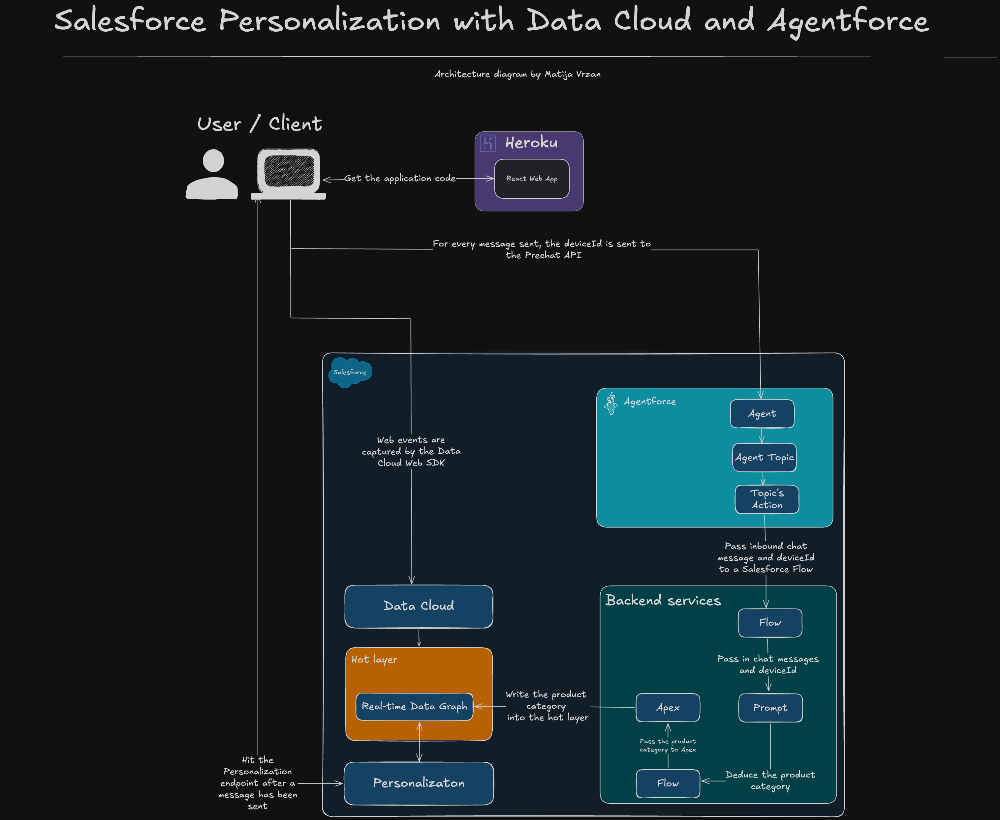

The application flow is the following:

**Client**

1. The user navigates to the website URL
2. The browser sends a request to the hosting server, in this case that is a Heroku dyno
3. The Heroku returns HTML and Javascript, and Javascript hydrates the website
4. During the page load, the [Data Cloud Web SDK](https://developer.salesforce.com/docs/atlas.en-us.c360a_api.meta/c360a_api/c360a_api_salesforce_interactions_web_sdk.htm) also gets loaded into the website
5. During the page load, the [Salesforce Embedded Chat ](https://help.salesforce.com/s/articleView?id=service.snapins_chat_setup.htm&type=5) also gest loaded into the website
6. Various web events get captured based on the [pre-defined web event JSON schema](./salesforce_config/quadstar_web_schema.json) and custom react [useSalesforceInteractions.ts](./client/src/hooks/useSalesforceInteractions.ts) hook
7. As part of the website load, the Agentforce chat also gets [initialized](./client/src/hooks/useLoadEmbeddedChat.tsx)
8. The `deviceId` is automatically generated by the Data Cloud Web SDK once the SDK is successfully loaded
9. The `deviceId` is then provided to the Agentforce chat on every sent message via the [Prechat API](./client/src/hooks/useLoadEmbeddedChat.tsx)

**Salesforce Backend**

1. The incoming chat message from the Agentforce chat is picked up by a Salesforce Agent
2. The Salesforce Agent has a dedicated Topic assigned to it
3. The assigned Topic has an Action that invokes a Salesforce Flow
4. Salesforce Flow takes the provided chat message and the `deviceId` from the Agent Action
5. The Flow invokes a custom **Prompt**
6. The custom **Prompt** is instructed to deduce the product category based on the provided chat message and the provided product catalog
7. Once the LLM deduces the product category, it will then return that in a specific format: `category,id`
8. The returned data gets passed back to the Salesforce Flow
9. Salesforce Flow takes the provided product category data and passes it off to a custom Apex class
10. The custom [Apex class](./salesforce_config/apex/sendEventEP.cls) writes the data back to the Data Cloud's real-time Data Graph

**Client Personalization**

1. The client sends a message to the Salesforce Personalization endpoint via the [Data Cloud Web SDK](./client/src/hooks/useSalesforceInteractions.ts#196) once the Agentforce chatbot responds
2. The Salesforce Personalization engine queries the real-time Data Graph for latest data
3. The Salesforce Personalization engine decides what the are appropriate product recommendations
4. The client receives the product recommendations from the Salesforce Personalization endpoint
5. Finally, the client makes the [changes on the web page](./client/src/components/Recommendations.tsx)

## Demo: Agentforce chat personalization


## Technologies used

**Client**

- [Vite](https://vitejs.dev/)
- [React](https://react.dev/)
- [TypeScript](https://www.typescriptlang.org/)
- [Zustand](https://github.com/pmndrs/zustand)
- [Tailwind](https://tailwindcss.com/)
- [Data Cloud SDK](https://developer.salesforce.com/docs/atlas.en-us.c360a_api.meta/c360a_api/c360a_api_connect_data.htm)
- [Salesforce Embedded Chat](https://developer.salesforce.com/docs/atlas.en-us.snapins_web_dev.meta/snapins_web_dev/snapins_web_overview.htm)

**Salesforce**

- [Salesforce Data Cloud](https://www.salesforce.com/data/)
- [Data Cloud Data Graphs](https://help.salesforce.com/s/articleView?id=sf.c360_a_data_graphs.htm&type=5)
- [Salesforce Flows](https://help.salesforce.com/s/articleView?id=platform.flow.htm&type=5)
- [Apex](https://developer.salesforce.com/docs/atlas.en-us.apexcode.meta/apexcode/apex_intro_what_is_apex.htm)
- [Prompts](https://www.salesforce.com/artificial-intelligence/prompt-builder/)
- [Salesforce Personalization](https://help.salesforce.com/s/articleView?id=mktg.mc_persnl.htm&type=5)
- [Agentforce](https://www.salesforce.com/ca/agentforce/)

# Configuration

## Requirements

To run this application locally, you will need the following:

- An active Salesforce account with Data Cloud, Embedded Service, and Personalization provisioned
- Node.js version 20 or later installed (type `node -v` in your terminal to check). Follow [instructions](https://nodejs.org/en/download) if you don't have node installed
- `npm` version 10.0.0 or later installed (type `npm -v` in your terminal to check). Node.js includes `npm`
- `git` installed. Follow the instructions to [install git](https://git-scm.com/downloads)
- [deployment only] A [Heroku account](https://signup.heroku.com/)

## Setup

### Local environment configuration

The first step is to clone the repository and install the project dependencies for the client folder via a terminal interface by running the `npm install` in the proper folder:

Client:

```
cd salesforce-connections-demo/client
npm install
```

The second step is to create a `.env` file in both the client folder. Find the `.env.example` files, copy and rename it to `.env`.

Client:

```
cd salesforce-connections-demo/client
cp .env.example .env
```

Edit the newly created `.env` files and update the variables with your account specific information.

```
# Salesforce Data Cloud details
VITE_DATA_CLOUD_WEB_SDK_URL=

# Embedded chat details
VITE_CHAT_ORG_ID=
VITE_CHAT_SCRIPT_URL=
VITE_CHAT_INSTANCE_URL=
VITE_CHAT_EMBEDDING_URL=
VITE_CHAT_EMBEDDING_API_NAME=

# Salesforce Personalization recommendation endpoint
VITE_PERSONALIZATION_ENDPOINT=
```

Once all of this is done, you are ready to run the application locally!

### Development

To run the application locally, use the command line, navigate to the `client` folder, ensure the dependencies are installed properly, and run the following:

```
cd salesforce-connections-demo/client
npm run dev
```

This will automatically run the development server. Your client app will run on `http://localhost:5173`.

When you make changes to your code, the server will automatically restart to fetch new changes.

### Salesforce environment

In order for this application to work end to end, there are several Salesforce configuration steps that have to happen first.

#### Data Cloud

1. Within Data Cloud, the first step is to configure a Website connector using the provided [web event schema](./salesforce_config/data_cloud_web_connector/quadstar_web_schema.json).
2. Configure Data Streams for the newly configured Website connector and map the fields appropriately for both behavior and individual data streams (if you don't want to use custom events, `Product Browse Engagement` is the only DMO you should map for the behavioral events)
3. The `Chat Activities`, `User Logged In`, and `User Logged Out` are custom Data Model Objects that have a N:1 relationship to the Individual DMO
4. Ensure you have a real-time Identity Resolution running
5. Create a real-time Data Graph

> Please note that the `Chat Activities`, `User Logged In`, and `User Logged Out` are custom Data Model Objects and are NOT needed for this demo. They are here as an example if you want to track these custom events

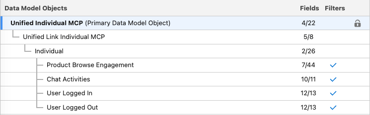

> Please note that if you don't want to use custom events, just use the `Product Browse Engagement` in your real-time Data Graph

6. Create an Item Data Graph

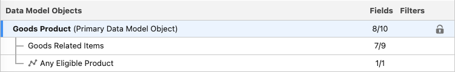

7. Create a Calculated Insights:

```
SELECT ssot__GoodsProduct__dlm.ssot__Id__c AS goodsProductsId__c, ssot__GoodsProduct__dlm.ssot__Name__c AS productName__c, COUNT(ssot__GoodsProduct__dlm.ssot__Id__c) AS ProductGeneral__c FROM ssot__GoodsProduct__dlm GROUP BY goodsProductsId__c,productName__c
```

8. Map the product catalog [files](./salesforce_config/product_catalog/)
9. Map the Goods Products DMO

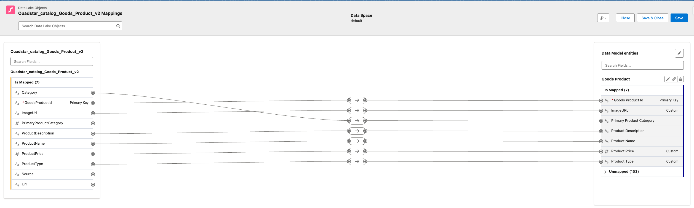

10. Create a custom DMO Goods Related Items and create N:1 relationship to Goods Products DMO

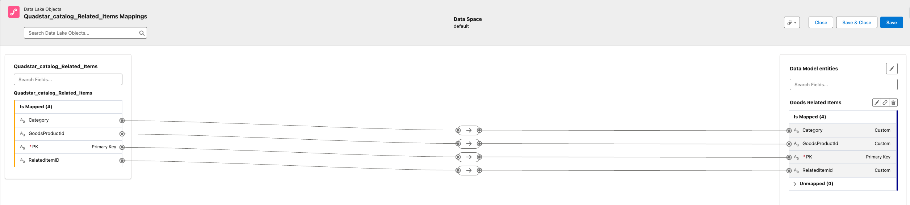

11. Create a custom DMO Goods Category and map it

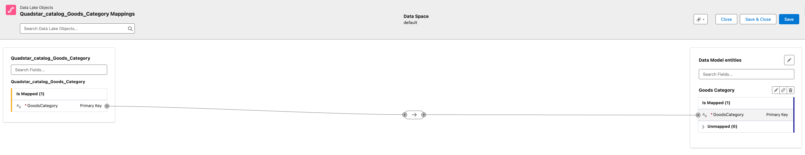

#### Salesforce Flows

Create two flows, one for the Agentforce chat and one for fetching product categories:

Agentforce chat Flow

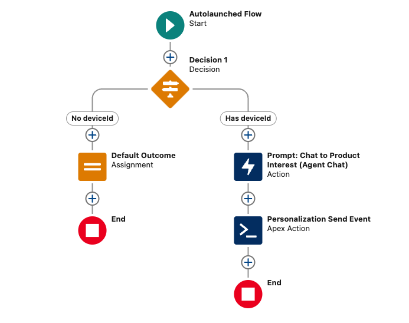

Catalog Categories Flow

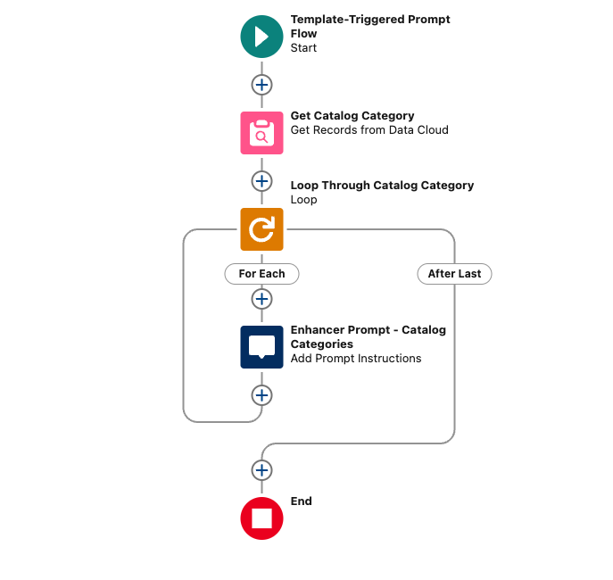

#### Personalization

1. Have a Recommender that points to the real-time Data Graph and the Items Data Graph
2. Crate a rule-based recommendations
3. Select the crated Calculated Insights
4. Create the following rules:

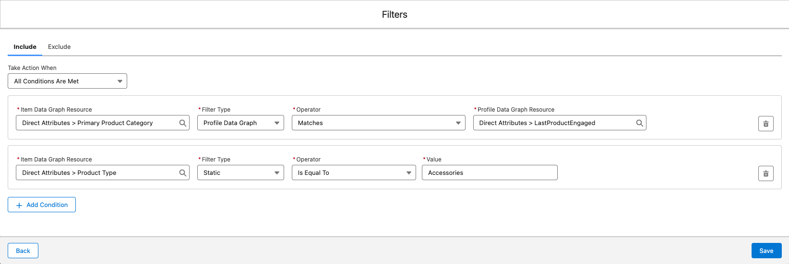

1. Create a Personalization Schema called `recsEP1`
2. Set the type to `Recommendations`
3. Create a Personalization Point called `recsEP1`
4. Select the newly created Personalization Schema

#### Prompt

Create the prompt:

```
You need to look through chat messages to understand the latest product category being discussed, then refer to a list of catalog categories, and return the category from this list that most closely matches the category currently being discussed.


Here is the device id:
{!$Input:individualId}

Here is the list of catalog categories:
{!$Flow:Enhancer_Get_Catalog_Categories.Prompt}

Here are the chat messages as a deserialized json string, which appears in the order from the oldest to most recent. Pick out the latest product category being discussed.
{!$Input:currentChatMessage}


Return only the value of the device id and category in the following format. Do not include additional modification. Remove the string "Category:". If you cannot determine the answer, return the string Unknown.

deviceId,category
```

#### Apex Class

Ensure you deploy the [Apex code](./salesforce_config/apex/) to your org. This will be referenced by the Agentforce chat Flow.

#### Custom Metadata Types

1. Go to Setup in Salesforce.
2. Search for "Custom Metadata Types" and create a new Custom Metadata Type, e.g., `Einstein_Personalization_Settings`.
3. Add a custom field to this metadata type, e.g., `Endpoint_URL__c` of type `Text`.
4. Go to the Custom Metadata Type you created.
5. Create a new record, e.g., `EP_API_Settings`, and set the `Endpoint_URL__c` field to your desired URL.
6. The URL value should be the `https://<YOUR_DATA_CLOUD_TENANT_URL>.c360a.salesforce.com/web/events/<APP_ID>'`
   1. Here's an example: `https://afdsagnjvmqyfdsa312gky32q.c360a.salesforce.com/web/events/2e17b431-3421-883os-a139-c0287491b043d'`

#### Agentforce

1. Create a new Embedded Service Deployment and make it a `Messaging for In-App and Web`
2. Build a Service Agent
3. Ensure the Service Agent has a dedicated Topic

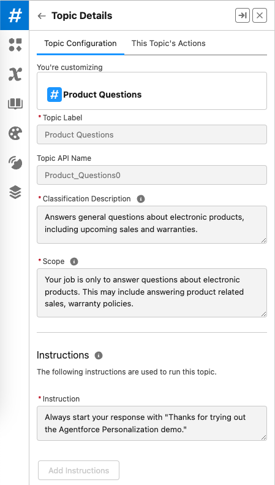

4. Ensure the Topic uses the dedicated Flow as its Action

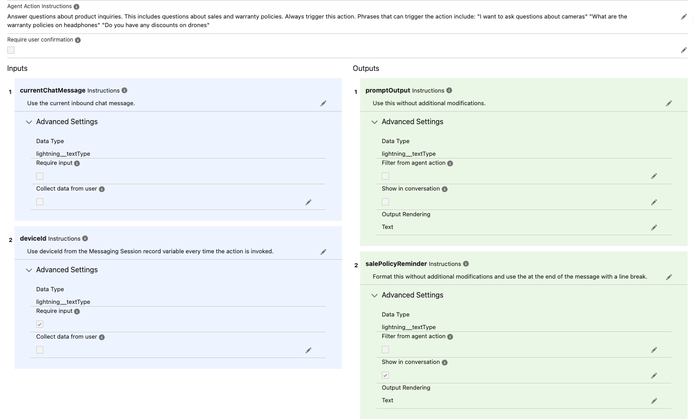

5. Add proper domains to Trusted URLs
6. Ensure you enable prechat on your embedded deployment and add `deviceId` field to it
7. Make sure you add the `deviceId` as a custom text filed on the Messaging Session object via Object Manager
8. Make sure you add the `deviceId` on the Messaging Session Settings as a custom parameter
9. Make sure you enable the `deviceId` as the context on the Service Agent

## Deployment

Once you are happy with your application, you can deploy it to Heroku!

To deploy the application to Heroku, please follow the [official instructions](https://devcenter.heroku.com/articles/git).

#### Can I deploy this anywhere else other than Heroku?

Absolutely! The only reason why Heroku is used here is because it is owned by Salesforce and at the moment of creating this I am a Salesforce employee.

> NOTE: Don't forget to re-create the environment variables in Heroku as the `.env` file will be ignored. Also, this is a proof of concept and not something that should be deployed in production.

# Kudos

Special thank you to [Daniel Kuo](https://github.com/dkuosf) and [Anne Pizzini](https://github.com/annepizzi).

# License

[MIT](http://www.opensource.org/licenses/mit-license.html)

# Disclaimer

This software is to be considered "sample code", a Type B Deliverable, and is delivered "as-is" to the user. Salesforce bears no responsibility to support the use or implementation of this software.
